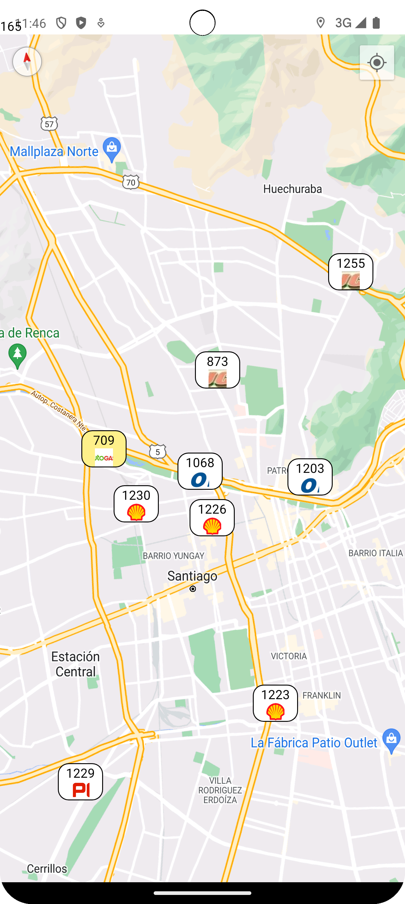

# APP PRECIO BENCINAS

    Apliacioón móvil para encontrar las mejores opciones de bencineras cercanas y precios de combusitbles de acuerdo a la ubicación en que te encuentres. Información obtenida desde api de Comisión Nacional de Energia.

## Caracteristicas:

1.  Mapa Interactivo: Visualiza todas las bencineras cercanas en un mapa interactivo. Los marcadores de colores te muestran las diferentes opciones disponibles.

2. Precios en Tiempo Real: Consulta los precios de combustible en tiempo real para cada bencinera. (Actualmente con mock para pruebas)

3. Precio más barato: Resalta gasolinera con precio de combustible más barato.

<h2 align="center">DEMO</h3> 

    

